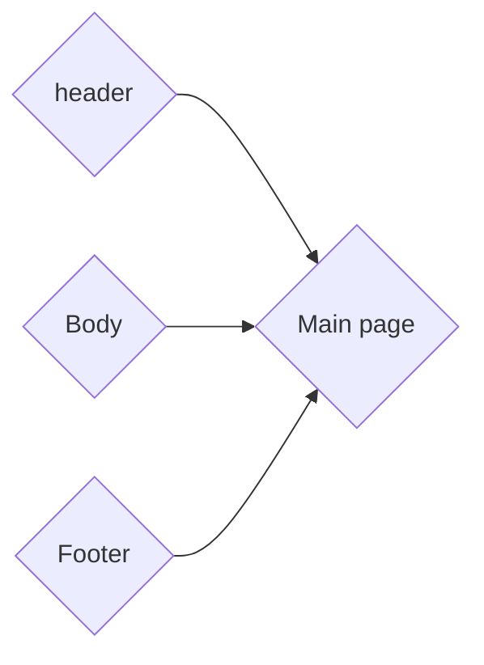

# Naming Convention

## JSX File Extension

Always use `.tsx` file extension for files with JSX syntax.

## File And Component Folder

The name of the file and the folder of components should exactly (case sensitive) match the name of the main (exported) component using camalCase.

## Style files

Each component may have a style file for seperating styles from main component.
Style files are located in the styles folder and the folder structure is the same as components folder.

## Exporting Components

All components should be exported **Named** exept **main pages**.

## Branches

Source of all new branches should be Develop branch.

## UML diagrams

